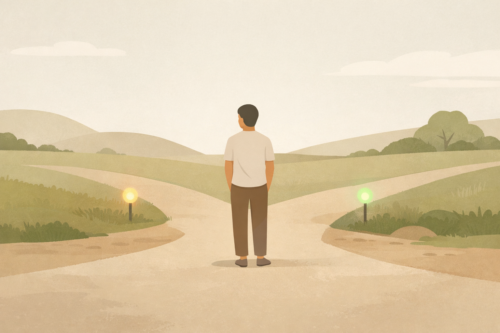

## **2. The Roots of Emotion: Wanting and Fearing**

Sometimes emotions don’t hurt because they’re intense.
They hurt because you can’t quite tell what’s happening.

You feel close to someone — but also uneasy.
You want to talk — then stop yourself.
You care — and feel irritated that you care at all.

Nothing dramatic happened.
Nothing is obviously wrong.

And still, something feels off.

That’s usually the moment when a quiet question shows up:
*Why does this feel so confusing?*
*Why can’t I just feel one thing?*

A lot of people your age start turning that question inward.
They assume the confusion itself means something is wrong with them.

**It doesn’t. This confusion makes sense.**

---

### Sitting with the mess for a moment

Before explaining anything, it helps to stay here for a second.

Because this mix — caring and resisting, wanting and pulling back —
isn’t rare.

It shows up when you’re waiting for a reply and keep checking your phone.
When you type something honest, then erase it.
When you’re included sometimes, but not always — and you don’t know what to make of that.

There’s no single emotion you can point to.
It’s more like several things happening at once.

And that overlap is what makes it hard to name.

---

### Two signals underneath the confusion

When people slow down enough to notice what’s underneath this kind of confusion,
two signals tend to show up again and again.

Not as answers.
Not as labels.

More like **dashboard lights**.

One is **wanting**.
The other is **fearing**.

They don’t tell you what to do.
They just turn on.

Wanting to hear back.
Wanting to know where you stand.
Wanting things to feel a little steadier.

And at the same time,
fearing rejection.
fearing embarrassment.
fearing that caring this much might cost you something.

Often, both lights are on at once.

---

### Wanting doesn’t mean you’re weak

Wanting is usually the light people feel embarrassed about first.

You’re told:

* “Don’t get attached.”
* “Don’t care so much.”
* “Why are you letting this affect you?”

So when you notice yourself:

* checking if someone saw your message
* hoping a friend saves you a seat
* feeling disappointed when plans change

you might start judging the wanting itself.

But wanting isn’t a flaw.
It’s a signal.

A dashboard light doesn’t turn on because the car is bad.
It turns on because something matters.

You want connection because connection steadies people.
You want clarity because uncertainty is stressful.
You want to matter because belonging has always mattered.

**At some point, wanting helped you stay connected or safe.**

That doesn’t mean every want needs to be followed.
It just means the wanting isn’t wrong for being there.

---

### Fear isn’t you being dramatic

Fear tends to get dismissed even faster.

It’s called:

* overthinking
* anxiety
* being dramatic

But fear is also a signal.

Sometimes it comes from past experiences.
Sometimes it comes from what’s happening right now —
mixed signals, pressure, not knowing where you stand.

Your body often notices this before you have words for it.

That drop in your stomach when a teacher says your name.
That pause before opening a message.
That tension when you walk into a room and aren’t sure how you’ll be received.

> **Sometimes fear isn’t a memory — it’s information.**

At some point, fear helped you avoid something that could have hurt.

---

### When both lights are on

This is where emotions start to feel overwhelming.

You want to reach out — and you’re afraid of being ignored.
You want to try — and you’re afraid of failing.
You want to be yourself — and you’re afraid of how that will land.

Two dashboard lights.
No instructions.

Just information.

That tug-of-war is exhausting.
Not because you’re broken —
but because **connection and protection are both important**.

A lot of emotional pain lives right there, in the overlap.

---

### What emotions are — and what they aren’t

Emotions don’t tell you who you are.
They don’t tell you what to do.

They point to:

* what matters
* what feels uncertain
* what your body has learned to watch for

Feeling something does **not** mean:

* you agree with it
* you’ll act on it
* it defines you

> **Feeling ≠ choosing**
> **Feeling ≠ intending**
> **Feeling ≠ acting**

That separation matters.
It gives you a little space to stand.

---

### A gentler way to look at what’s happening

Instead of asking,
*“What’s wrong with me?”*

You might — only if it feels okay — wonder:
*Which light is on right now?*
*Is this more wanting, more fear, or both?*

Not to fix it.
Not to calm it down.

Just to understand what your system is responding to.

**Understanding is not a demand to change.**

---

### Before you move on

If emotions feel especially loud right now, pause.

Check the basics:

* sleep
* food
* rest
* light

> **A tired body makes every signal louder.**

And remember:

> **You will forget this. You will slide back. That is normal.**

That isn’t failure.
That’s how things slowly settle and shift over time.

---

### A reflection (optional)

Think of a recent moment that stayed with you —
a text, a silence, a conversation, a result.

Without judging yourself,
can you notice which light was on — **wanting**, **fear**, or both?

You don’t need to do anything with the answer.

Just noticing is enough for now.

---

Sometimes, when the same lights keep turning on,
we start to tell a story about what that means.

*“This is just who I am.”*
*“I’m too much.”*
*“I always react like this.”*

Those stories don’t arrive all at once.
They build quietly, from repeated feelings that never quite settle.

In the next post, we’ll look at how that happens —
how emotions, over time, begin to shape identity —
and why identity is often **learned protection**, not truth.

For now, it’s enough to notice the signals
without deciding what they say about you.

> **Nothing needs to be justified to be noticed.**

We’ll stay with this — slowly — from here.
