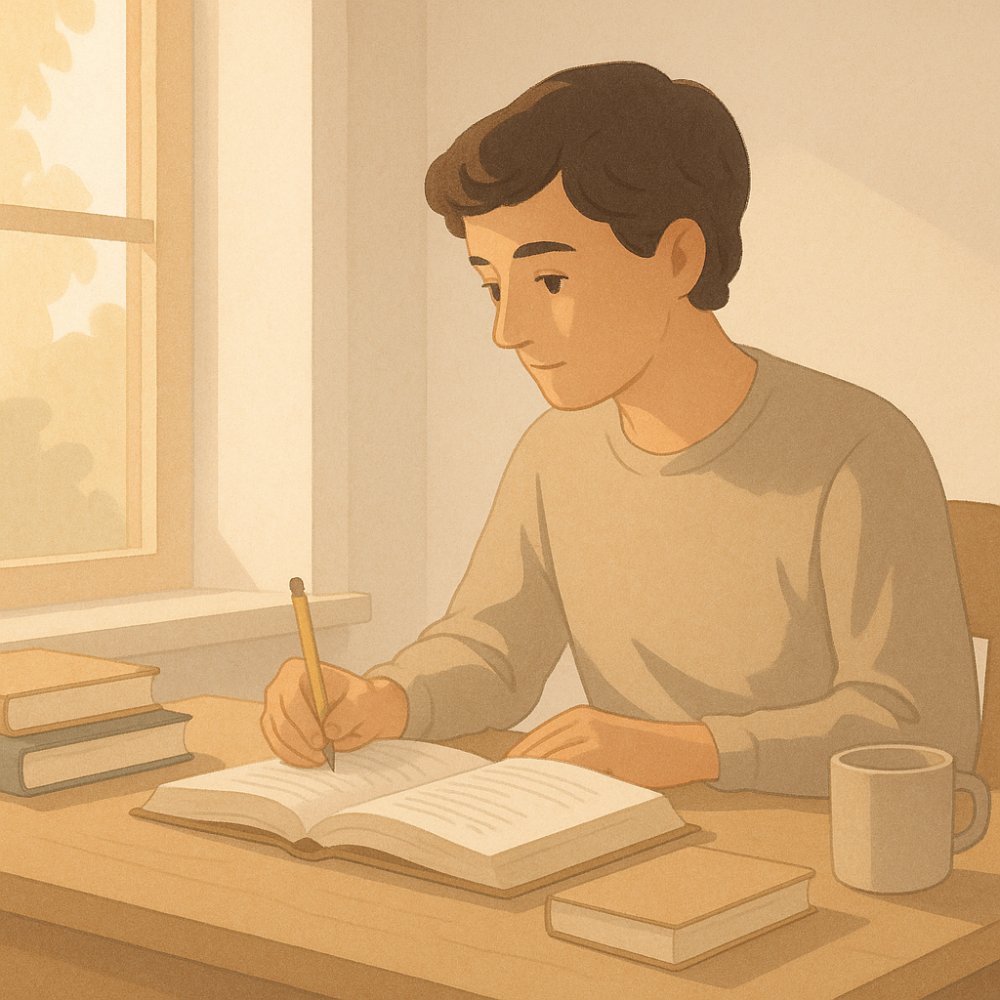
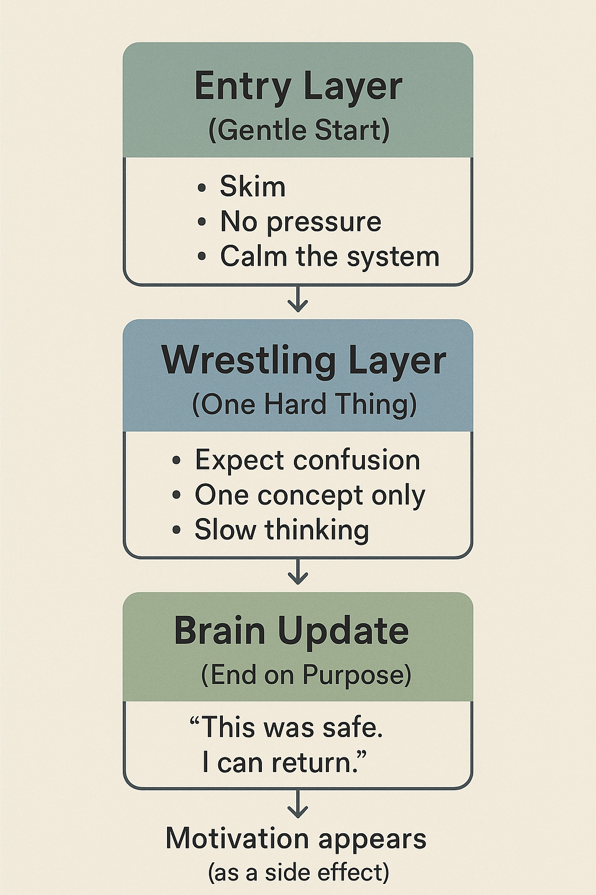
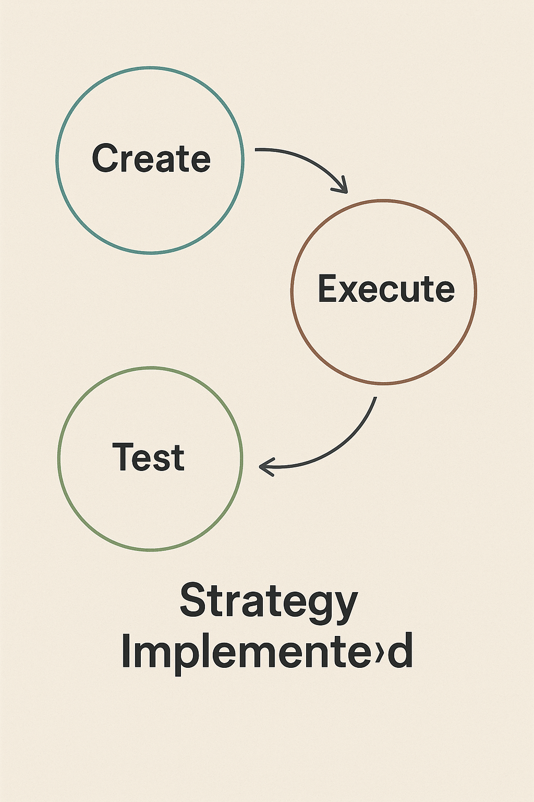

# How to Learn Hard Things Without Burning Yourself Out



At some point, everyone hits the same wall.

You sit down to study.  
The book is open.  
The video is paused at 0:00.  
Your brain already feels tired.

You tell yourself, *“I just need to focus.”*

But the harder you push, the worse it gets.

If that sounds familiar, this article is for you.

Not because you’re lazy.  
Not because you lack discipline.  
But because the way most of us try to learn difficult things quietly works against how the brain actually functions.

---

## Why “Trying Harder” Often Makes Things Worse

Most of us were taught a simple rule:

> **If something is difficult, push through it.**

And for short tasks, that sometimes works.

But for complex topics—math, programming, research papers, philosophy, advanced science—it often fails.

Here’s what failure usually looks like:

You sit down planning to study for an hour.  
Five minutes in, you feel behind.  
Ten minutes in, you’re confused.  
Twenty minutes in, you’re stressed and rereading the same paragraph.  
Eventually, you stop—exhausted, frustrated, and quietly convinced something is wrong with you.

Nothing is wrong with you.

Your brain just switched into **survival mode**.

When stress enters the picture, the part of your brain responsible for reasoning, planning, and holding ideas in mind goes offline. You can still stare at the page. You can still “work.” But deep understanding becomes almost impossible.

---

## A Different Starting Point: Learning Needs Safety

Here’s a counterintuitive idea:

> **Learning doesn’t begin with motivation.  
> It begins with safety.**

Most people think they struggle because they “can’t stay motivated.”

But motivation is not a stable trait.  
It’s a state.

It depends on sleep, stress, confidence, and recent wins or losses. That means it comes and goes—sometimes daily.

So if your learning method *requires* motivation to start, it’s already fragile.

Safety, on the other hand, is something you can design.

When you feel allowed to be slow, unsure, and unfinished, your brain stays open.  
When you don’t, it shuts down.

This is why two people can study the same material for the same amount of time and get very different results.

One is calm. Curious. A little confused, but steady.  
The other is tense, rushed, and silently panicking.

Only one of those brains is actually learning.

---

## The Three-Layer Learning System

Instead of relying on motivation, this approach relies on **structure**.

Not rigid structure.  
Supportive structure.

A system that still works on low-energy days.

### The System at a Glance



Most people assume learning works like this:

```

Motivation → Effort → Learning

```

But this system quietly reverses the order:

```

Safe start
↓
Contained effort
↓
Positive ending
↓
Memory updated
↓
Motivation (later)

```

Motivation isn’t the fuel.  
It’s the exhaust.

---

### 1. The Entry Layer *(about 5–15 minutes)*

This layer exists for one reason:  
to make starting safe.

❌ **The Old Way (Survival Mode):**  
You open a chapter and immediately try to understand everything. You underline. You take notes. You test yourself. Within minutes, you feel overwhelmed.

✅ **The New Way (Safety First):**  
You skim. Casually. Almost lazily.

You read the headings.  
You glance at a diagram.  
You read one paragraph and stop.

No notes. No testing. No pressure.

The only goal is this:

> *“I’m not tense.”*

You’re not trying to learn yet.  
You’re lowering the cost of entry.

This is how systems replace motivation:  
they remove the need to feel ready.

---

### 2. The Wrestling Layer *(about 15–40 minutes)*

This is where real learning happens.

Not because it’s easy—but because it’s **contained**.

You focus on one idea. Not the whole chapter. Not the entire syllabus. Just one concept.

And you let it be hard.

❌ **The Old Way (Performance Mode):**  
You try to “get it” immediately. When you don’t, you assume you’re bad at this. You rush. You Google frantically. You feel stupid.

✅ **The New Way (Learning Mode):**  
You expect confusion.

You ask slower questions:

- *What problem is this trying to solve?*
- *Why does this exist?*
- *What does this remind me of, even roughly?*

Your explanations are clumsy. Incomplete. Sometimes wrong.

That’s not a failure state.  
That’s the state where new mental structures are forming.

Confusion here isn’t a warning sign.  
It’s evidence of progress.

---

### 3. The Lock-In Layer *(about 5–10 minutes)*

This is where habits are either built—or quietly destroyed.

Most people stop only when they’re exhausted.

Instead, stop intentionally.

❌ **The Old Way (Drain & Quit):**  
You push until you’re empty. The session ends with frustration. Your brain remembers learning as painful.

✅ **The New Way (Stop on Purpose):**  
You write three messy bullet points.

- “The sun hits the leaf.”
- “Something about chlorophyll trapping energy?”
- “Make sugar = plant food.”

It doesn’t have to be smart.  
It just has to be yours.

You say, *“I understand this more than I did before.”*  
Then you stop.

You pair that ending with something pleasant—tea, music, a short walk.

Your brain updates the memory:

> *“This effort was safe. I can return.”*

That’s how habits form—not through willpower, but through emotional reinforcement.

---

## Old Way vs New Way (At a Glance)



---

## Why This Works (When Motivation Fails)

Understanding complex material doesn’t grow smoothly.

It grows in **jumps**.

Often, nothing feels like it’s working.  
Then—sometimes later, when you’re walking or resting—something clicks.

People quit right before that moment because they believe effort should feel rewarding immediately.

This system works because it:

- Doesn’t depend on motivation  
- Protects you on low-energy days  
- Rewards returning, not pushing  

Over time, something interesting happens.

You don’t *force* yourself to study.  
You simply come back.

Motivation becomes a side effect—not a requirement.

---

## The Myth of Motivation

Most people think:

> *“If I could just stay motivated, I’d be consistent.”*

But consistency doesn’t come from motivation.  
It comes from **removing friction**.

When starting is gentle,  
when struggle is contained,  
when stopping feels good,

your brain stops resisting.

Motivation shows up **after** the system works—not before.

---

## The Minimum Viable Day

Some days, your energy is low. Focus is thin. Everything feels heavy.

On those days, do only the Entry Layer.

Read one paragraph.  
Close the book.

That still counts.

Because success isn’t measured by intensity.  
It’s measured by returning.

---

## The One Rule That Changes Everything

If you remember nothing else, remember this:

> **Never end a learning session feeling defeated.**

Stop while curiosity is still alive.  
Even if that means stopping early.

Especially then.

Learning hard things isn’t about becoming tougher.  
It’s about designing a system your brain doesn’t need to fight.

And when safety replaces pressure,  
complexity becomes something you can grow into—steadily, quietly, and for a long time.

